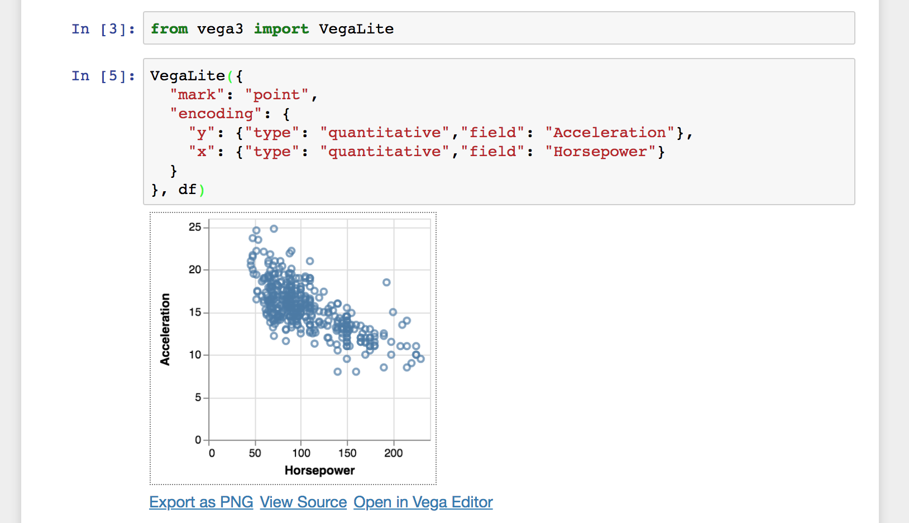

# IPython Vega
[](https://pypi.python.org/pypi/vega)
[](https://travis-ci.org/vega/ipyvega)

IPython/Jupyter notebook module for [Vega 5](https://github.com/vega/vega), and [Vega-Lite 3](https://github.com/vega/vega-lite). Notebooks with embedded visualizations can be viewed on [GitHub](https://github.com/vega/ipyvega/blob/master/notebooks/VegaLite.ipynb) and [nbviewer](https://nbviewer.jupyter.org/github/vega/ipyvega/blob/master/notebooks/VegaLite.ipynb). If you use JupyterLab (not the notebook), you don't need to install this extension since JupyterLab comes with built-in support for Vega and Vega-Lite.

Available on [pypi](https://pypi.python.org/pypi/vega) and [Conda Forge](https://anaconda.org/conda-forge/vega) as `vega`.



## Install and run

### Python Package Index

To install `vega` and its dependencies from the Python Package Index using
`pip`, use the following commands:

```sh
pip install jupyter pandas vega
pip install --upgrade notebook  # need jupyter_client >= 4.2 for sys-prefix below
jupyter nbextension install --sys-prefix --py vega  # not needed in notebook >= 5.3
```

### Conda Forge

If you use conda, you probably already have the latest versions of the notebook and pandas installed. To install `vega` extension run:

```sh
conda install vega
```

### From Source

To install from source, make sure you have `jupyter` and `pandas` installed,
then download this repository and run
```sh
python setup.py install
```

## Usage

Once the package is installed, run
```sh
jupyter notebook
```
to launch the Jupyter notebook server, and use `vega` within the notebook.
See the example notebooks for [Vega-Lite](https://github.com/vega/ipyvega/blob/master/notebooks/VegaLite.ipynb) and [Vega](https://github.com/vega/ipyvega/blob/master/notebooks/Vega.ipynb).

To run the notebooks yourself, you need to get the file [`cars.json`](https://raw.githubusercontent.com/vega/ipyvega/master/notebooks/cars.json).


## Developers

Install requirements: `pip install -r requirements.txt`

Symlink files instead of copying files:

```sh
python setup.py develop
jupyter nbextension install --py --symlink vega  # not needed in notebook >= 5.3
```

Run kernel: `jupyter notebook`

To rebuild the javascript continuously, run `yarn watch`.

Publish a new version to pypi with `python3 setup.py sdist upload`.

### How to make a release

* Update the javascript dependendencies by changing `package.json` (e.g. with [ncu](https://www.npmjs.com/package/npm-check-updates))
* Run `yarn`
* Rebuild the javascript with `yarn build`
* Make sure that everything still works (launch notebook and try the examples)
* Update the version number in `package.json` and `__index__.py` and add a git tag
* `git push`
* Run `python setup.py sdist upload` to update https://pypi.python.org/pypi/vega
